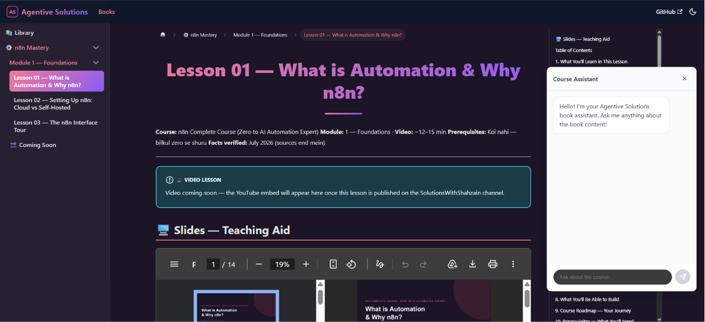

# Agentive Solutions — Interactive Book

[](https://docusaurus.io/) [](https://fastapi.tiangolo.com/) [](https://openai.github.io/openai-agents-python/) [](https://qdrant.tech/) [](https://react.dev/) [](LICENSE)

The **Agentive Solutions** interactive book — a multi-book learning platform for AI automation with a **live AI tutor**. The first book is **n8n Mastery** (42 lessons, 6 modules); a **RAG for Automation** book and more (Google ADK, OpenAI Agents SDK) are on the way.

**📖 Live book:** https://shahzain-ali.github.io/agentive-solutions-book/



## ✨ AI Tutor — Live (Agentic RAG)

Every page has a floating chat tutor that answers questions **grounded in the book content, with citations** — try it on the live site.

- **Agentic RAG** — retrieval is a *tool* the agent calls only when needed (OpenAI Agents SDK function calling); greetings get no fake citations
- **Relevance-filtered citations** — top-2 sources by cosine score, junk sections excluded at both embedding and citation level
- **Bilingual** — answers mirror the reader's language (English / Roman Urdu), with explicit language requests honored first
- **Production hardening** — per-IP rate limiting (slowapi), OpenAI budget caps, tightened CORS, input sanitization
- **Chat history** — session persistence in Neon Postgres

## Architecture

```
GitHub Pages (Docusaurus + React ChatWidget)
        │  HTTPS
        ▼
Render (FastAPI, Docker)
        ├── OpenAI Agents SDK  → gpt-4o-mini (generation)
        ├── Qdrant Cloud       → vector search (text-embedding-3-small, 1536d)
        └── Neon Postgres      → chat sessions & history
```

- **Multi-book layout** — each course lives under its own path (`/docs/n8n-mastery/…`, `/docs/rag-for-automation/…`)
- **Lesson pages** — video embed + full chapter + embedded slide deck (Teaching Aid) + resources
- **Content pipeline** — `backend/scripts/embed_content.py` chunks all book markdown (heading-aware, TOC excluded) and upserts embeddings to Qdrant

## Tech Stack

| Layer | Choice |
|-------|--------|
| Site | Docusaurus 3 + GitHub Pages (Actions CI/CD) |
| Backend | FastAPI on Render (Docker) |
| Agent | OpenAI Agents SDK (tool-based retrieval) |
| Vector DB | Qdrant Cloud |
| Chat DB | Neon Postgres |
| Analytics | Google Analytics 4 |

## Local Development

```bash
# Frontend
npm install
REACT_APP_API_URL=http://localhost:8000 npm run start

# Backend
cd backend
python3 -m venv .venv && .venv/bin/pip install -r requirements.txt
cp ../.env.example ../.env   # fill in your keys
.venv/bin/python scripts/setup_qdrant.py
.venv/bin/python scripts/embed_content.py --docs-dir ../docs/
.venv/bin/python -m uvicorn src.main:app --port 8000
```

## Deployment

- **Frontend:** push to `main` → GitHub Actions builds and deploys to Pages
- **Backend:** Render auto-deploys from `backend/` (Root Directory) on every push
- Environment variables (`OPENAI_API_KEY`, `QDRANT_URL`, `QDRANT_API_KEY`, `NEON_DATABASE_URL`) are set in Render's dashboard — never committed

## Content Source

n8n Mastery lesson content is authored in the [n8n-mastery](https://github.com/Shahzain-Ali/n8n-mastery) course repo and copied here as-is — the notes are the single source of truth. The RAG for Automation book is authored directly in this repo.

## License

- **Code** (site config, components, backend, scripts): [MIT](LICENSE)
- **Course content** (`docs/`, slides, resources): All Rights Reserved — see [LICENSE-CONTENT.md](LICENSE-CONTENT.md)
